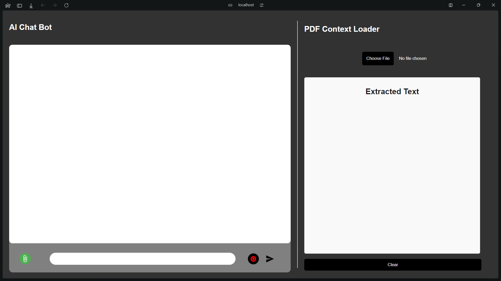
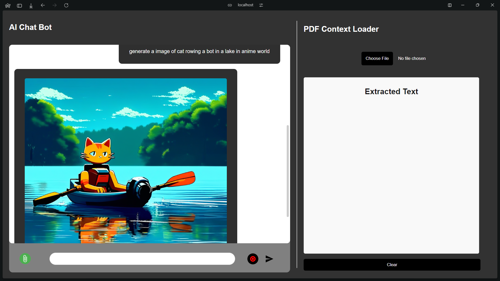
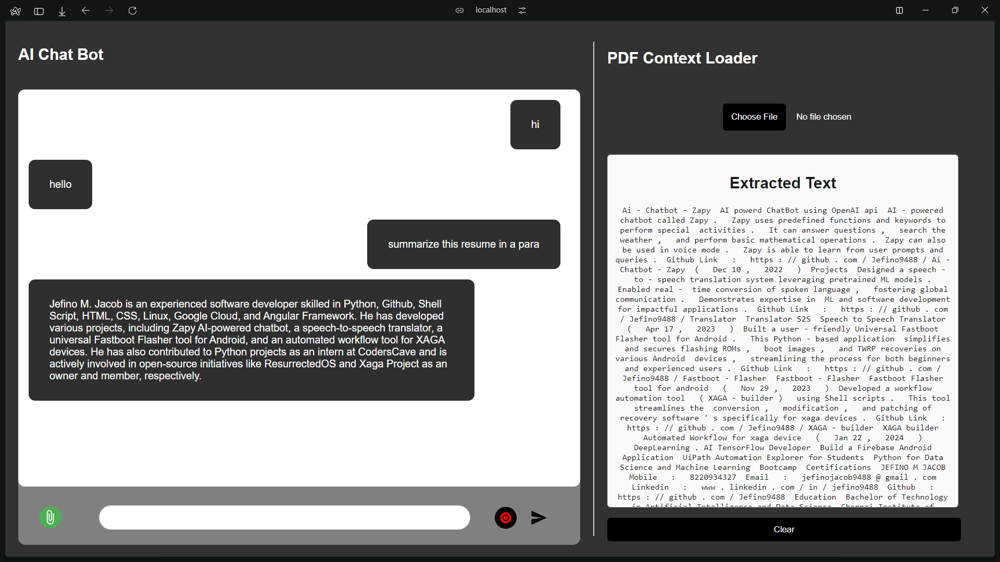

# AI-`ChatBot`

# AI Chatbot with PDF Context Loader

This project implements an AI chatbot that can converse with users, generate images based on prompts, and extract text from PDF files to use as context for chat interactions. It uses the Gemini models for generating responses and the Monster API for image generation.

## Features

- **AI Chatbot**: Interact with the AI using text input.
- **Voice Input**: Record and transcribe voice messages to interact with the AI.
- **Image Generation**: Generate images based on text prompts.
- **PDF Context Loader**: Upload PDF files, extract text, and use it as context for chat interactions.

## UI Screenshots

### Chatbot Interface


### Image Generation


### PDF Context Loader


## Tech Stack

- **Frontend**: Vite + React.js
- **Backend**: Flask
- **APIs**:
  - Google Generative AI (Gemini models)
  - Google Speech-to-Text
  - Monster API for image generation

## Installation

### Prerequisites

- Node.js and npm
- Python and pip
- Google Gemini Key [Gemini](https://aistudio.google.com/app/apikey)
- Monster API key [Monster](https://monsterapi.ai/user/dashboard)

### Frontend Setup

1. Clone the repository:

```sh
git clone https://github.com/Jefino9488/AI_Chatbot.git
cd AI_Chatbot
```

2. Install the dependencies:

```sh
npm install
```

3. Create a `.env` file in the root directory and add your Monster API key:

```sh
VITE_MONSTER_API_KEY=your_monster_api_key
VITE_GOOGLE_API_KEY=your_google_api_key
```

4. Run the frontend:

```sh
npm run dev
```

### Backend Setup

1. Navigate to the `Server` directory:

```sh
cd Server
```

2. Create a virtual environment and activate it:

```sh
python -m venv venv
source venv/bin/activate  # On Windows use `venv\Scripts\activate`
```

3. Install the dependencies:

```sh
pip install -r requirements.txt
```

4. Create a `.env` file in the `backend` directory and add your Google API key:

```sh
API_KEY=your_google_api_key
```

5. Run the backend server:

```sh
python main.py
```

### Project Structure

```
AI_Chatbot/
├── Server/
│   ├── venv/
│   ├── main.py
│   ├── requirements.txt
│   └── .env
├── Chatbot/
│   ├── package.json
│   ├── vite.config.js
│   ├── index.html
│   ├── .env
│   └── src/
│       ├── App.css
│       ├── App.jsx
│       └── index.js
├── .gitignore
└── README.md
```

## Usage

### Chatbot

- Type a message in the input box and press Enter or click the Send button to interact with the chatbot.
- To record a voice message, click the Record button, speak your message, and click the Stop button.

### Image Generation

- Type a message starting with "generate" followed by your prompt (e.g., "generate a sunset over mountains") and send it to get an image generated.

### PDF Context Loader

- Click the Choose File button to upload a PDF.
- The text extracted from the PDF will be displayed and used as context for chat interactions.
- Click the Clear button to clear the extracted text.

## API Endpoints

### /chat

**Method**: POST

**Description**: Send a message to the chatbot.

**Request Body**:

```json
{
  "message": "Your message here",
  "context": "Optional context here",
  "model": "Selected model name here"
}
```

**Response**:

```json
{
  "response": "Chatbot's response"
}
```

### /generate

**Method**: POST

**Description**: Generate an image based on a text prompt.

**Request Body**:

```json
{
  "prompt": "Your prompt here",
  "model": "Selected model name here",
  "style": "Optional style here",
  "seed": "Optional seed here",
  "..." : "Other optional parameters"
}
```

**Response**:

```json
{
  "Output": "Image URL"
}
```

### Future Improvements

- Add more features to the chatbot, such as image recognition and text-to-speech.
- Implement more advanced AI models for generating responses and images.
- Improve the UI/UX of the application.
- Add user authentication and data persistence.
- Optimize the backend server for better performance.
- etc.

## Contribution

1. Fork the repository.
2. Create a new branch: `git checkout -b my-feature-branch`
3. Make your changes and commit them: `git commit -m 'Add some feature'`
4. Push to the branch: `git push origin my-feature-branch`
5. Open a pull request.

## License

This project is licensed under the MIT License - see the LICENSE file for details.
